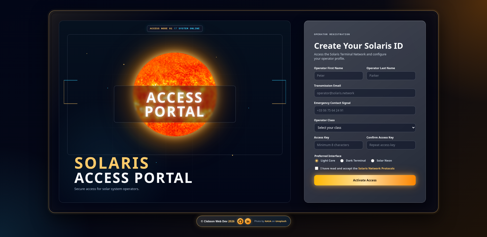

# Solaris Access Portal

**Solaris Access Portal** is a futuristic sign-up form built with vanilla HTML, CSS, and JavaScript.

The project was created as part of **The Odin Project** curriculum to practice intermediate HTML/CSS form controls, validation, responsive layout, accessibility, and visual design. It belongs to the same fictional cyber-solar universe as my previous project, **Solaris Terminal**.

The page allows a fictional operator to create a **Solaris ID** and access the **Solaris Terminal Network**.

## Preview

Desktop preview:



## Live Demo

[View live project](https://progritit.github.io/Solaris-Access-Portal/)

## Project Concept

The idea behind the project is to transform a simple sign-up form into a polished interface that feels like part of a larger fictional system.

Instead of a generic registration page, the user is invited to create a **Solaris ID** through a cyber-solar access portal. The visual direction combines:

* dark futuristic interface design;
* solar gold and orange highlights;
* cyber blue accents;
* glassmorphism panels;
* terminal-inspired labels;
* a dedicated fictional protocols page.

## Features

* Responsive sign-up form layout
* Cyber-solar visual identity
* Split-screen desktop design
* Mobile-friendly layout
* HTML form controls:

  * text inputs
  * email input
  * telephone input
  * password inputs
  * select dropdown
  * radio buttons
  * checkbox
* Required field validation
* Minimum password length
* Password confirmation validation with JavaScript
* Custom valid/invalid input styling
* Accessible labels and form structure
* Dedicated **Solaris Network Protocols** page
* Self-hosted local fonts for better privacy practices
* Decorative image attribution in the footer
* No real data storage or backend connection

## Built With

* HTML5
* CSS3
* Vanilla JavaScript
* CSS Grid
* Flexbox
* Custom properties
* Media queries
* Local `@font-face` fonts

## Privacy Note

This is a front-end educational project.

The form does not create a real account, does not send data to a backend, and does not store submitted information in a database.

JavaScript is used only to validate the form, display feedback, and simulate a successful access activation.

Custom fonts are self-hosted locally instead of being loaded from an external CDN, as a privacy-conscious choice.

## Pages

### `index.html`

Main Solaris Access Portal sign-up form.

### `protocols.html`

Dedicated page containing the fictional **Solaris Network Protocols**, linked from the form checkbox.

## Image Credit

The solar image used in this project is credited in the page footer:

Photo by [NASA](https://unsplash.com/fr/@nasa) on [Unsplash](https://unsplash.com/fr).

## What I Practiced

Through this project, I practiced:

* building semantic HTML forms;
* using different input types correctly;
* applying native browser validation;
* styling focus, valid, and invalid states;
* creating responsive layouts;
* organizing a multi-page project;
* using local fonts with `@font-face`;
* improving visual consistency across a project;
* creating a more complete portfolio-style user interface.

## Folder Structure

```txt
solaris-access-portal/
├── assets/
│   ├── fonts/
│   │   ├── inter-variable.ttf
│   │   └── orbitron-variable.ttf
│   ├── screenshots/
│   │   └── desktop-preview.png
│   └── solar-sun.webp
├── index.html
├── protocols.html
├── script.js
├── styles.css
└── README.md
```

## Future Improvements

Possible future improvements include:

* adding a real backend after learning Node.js and Express;
* storing operators in a database;
* adding dark/light interface mode switching;
* improving animation details;
* adding a stronger accessibility audit;
* creating a complete Solaris design system.

## Author

**Clebson Web Dev**

* GitHub: [@progritit](https://github.com/progritit)
* LinkedIn: [Clebson Costa](https://www.linkedin.com/in/clebsoncosta)

## Status

Project in progress as part of my web development learning path.
